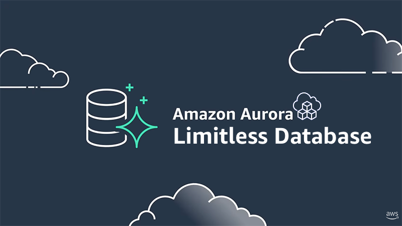
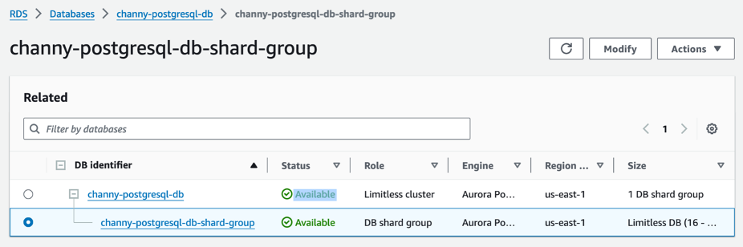
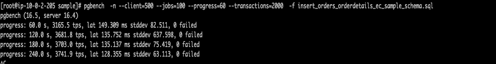
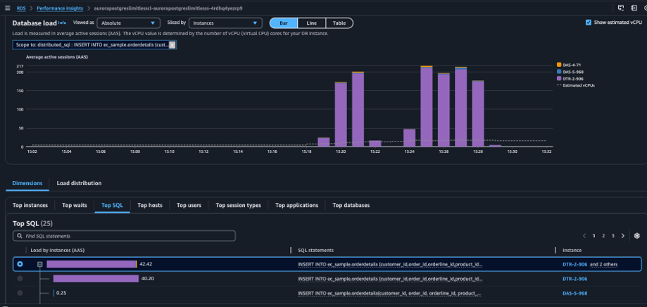
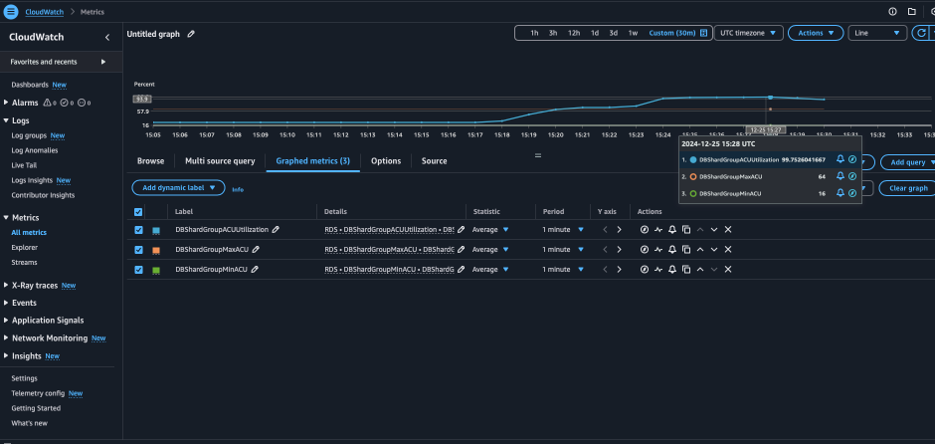
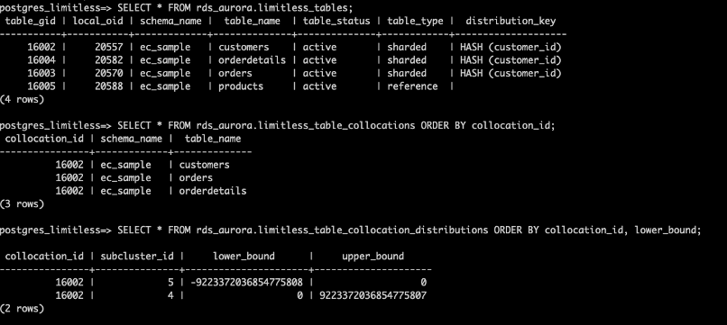
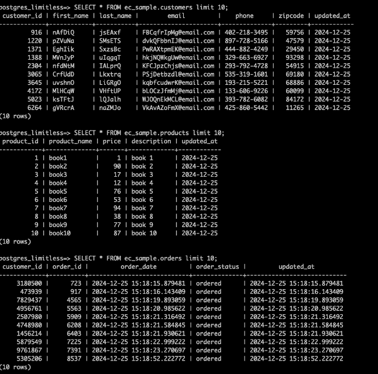

<p align="center">
  <a href="https://dev.to/vumdao">
    
  </a>
</p>
<h1 align="center">
  <div><b>CDK AWS Aurora PostgreSQL Limitless</b></div>
</h1>

## Abstract
- The Amazon Aurora PostgreSQL Limitless Database is now generally available, offering an advanced solution to scale your Aurora cluster seamlessly. This technology enables millions of write transactions per second and supports petabytes of data, all while maintaining the simplicity of operating a single database instance.
- This post outlines a structured approach to creating an Amazon Aurora PostgreSQL Limitless Database using the AWS Cloud Development Kit (CDK) in TypeScript for demontration of Amazon Aurora PostgreSQL Limitless Database

## Table Of Contents
* [Deploying Aurora PostgreSQL Limitless Database Using AWS CDK](#Deploying-Aurora-PostgreSQL-Limitless-Database-Using-AWS-CDK)
* [Test](#Test)
* [Check workload and scaling](#Check-workload-and-scaling)

---

## 🚀 Deploying Aurora PostgreSQL Limitless Database Using AWS CDK <a name="Deploying-Aurora-PostgreSQL-Limitless-Database-Using-AWS-CDK"></a>
- The structure includes VPC, Aurora PostgreSQL Limitless Database with one shard group, secret manager for storing RDS credential, EC2 as bastion-host for access database in private network

  <image src=images/diagram.png width=600>

- Source code:
  ```
  src
  ├── bin
  │   └── main.ts
  └── lib
      ├── cluster.ts
      └── shared
          ├── constants.ts
          ├── environment.ts
          ├── index.ts
          └── tagging.ts
  ```

- Adjust `CDK_DEFAULT_REGION` and `CDK_DEFAULT_ACCOUNT` in `src/lib/shared/constants` to yours

- Adjust the max
  ```
  serverlessV2MaxCapacity: 64, // Adjust this for your test.
  serverlessV2MinCapacity: 16, // Minimum allow is 16
  ```

- Deploy
  ```
  ✗ cdk ls
  AuroraPostgresLimitlessClusterStack

  ✗ cdk deploy AuroraPostgresLimitlessClusterStack
  ```

## 🚀 Test <a name="Test"></a>
- Cluster created

  

- Go to `sample_sql`
  ```
  cd sample_sql
  ```

- Create E-Commerce sample schema's standard tables
  ```
  \i create_standard_tables_ec_sample_schema.sql
  ```

- Convert E-Commerce sample schema's standard tables to limitless tables
  ```
  \i convert_standard_tables_to_limitless_ec_sample_schema.sql
  ```

- Load data into the orders and orderdetails tables using `pgbench`
  ```
  pgbench  -n --client=500 --jobs=100 --progress=60 --transactions=2000  -f insert_orders_orderdetails_ec_sample_schema.sql
  ```

  

## 🚀 Check workload and scaling <a name="Check-workload-and-scaling"></a>
- Performance insight

  

- Cloudwatch metrics

  

- Query limitless table

  

- Query database tables

  

## 🚀 Cleanup
- Destroy resources to avoid cost
  ```
  cdk destroy AuroraPostgresLimitlessClusterStack
  ```

## 🚀 Conclusion
- Give Aurora PostgreSQL Limitless Database a try by using AWS CDK to provision cluster faster and in secure way
- Remember to adjust the query size and time of running to avoid huge cost

---

References:
- [Aurora Limitless Series' Articles](https://dev.to/franckpachot/series/29542)
- [Sample-schemas-for-amazon-aurora-postgresql-limitless-database](https://github.com/aws-samples/sample-schemas-for-amazon-aurora-postgresql-limitless-database)
